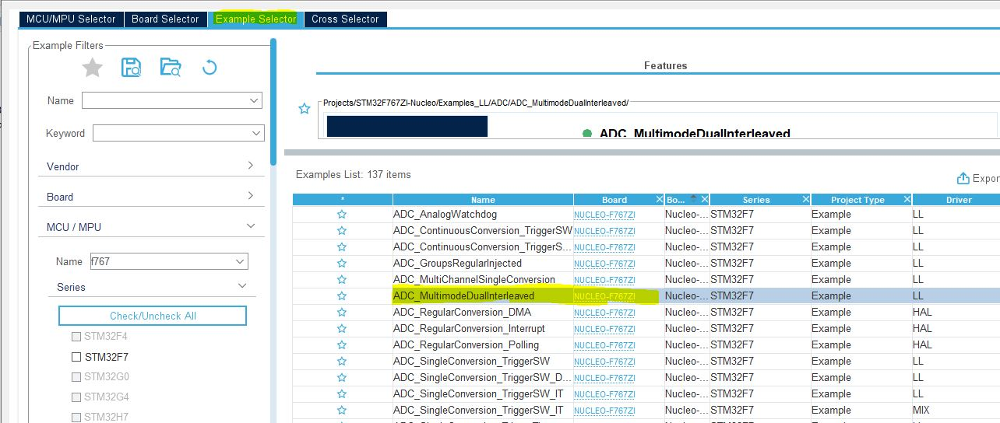

# Title
## subtitle
hjhkjhjkh
we need to search for 
```cc
static void Init_Debug( void )
{
#if (CFG_DEBUGGER_SUPPORTED == 1)
  /**
   * Keep debugger enabled while in any low power mode
   */
  HAL_DBGMCU_EnableDBGSleepMode();
  /* HAL_DBGMCU_EnableDBGStopMode(); */
  /* HAL_DBGMCU_EnableDBGStandbyMode(); */

  /***************** ENABLE DEBUGGER *************************************/
  LL_EXTI_EnableIT_32_63(LL_EXTI_LINE_48);
  LL_C2_EXTI_EnableIT_32_63(LL_EXTI_LINE_48);

#else
```

Go to st site :
[Link](www.st.cm)
